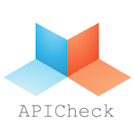
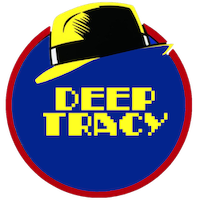

# BBVA Labs - Security

## Who we are

We are security practitioners controlling our paranoia (sometimes) and focusing our knowledge and experience to build new security solutions and practices for new (and old) IT systems and processes

## What we do

We research new **security tendencies, techniques and solutions** in Cyber-security issues, especially focused in **SecDevOps** processes. with near-future impact in the security of BBVA Group and hopefully in the rest of the world

## Our projects

We like Open Source and we believe the in mantra **"Don't reinvent the wheel"**.

We create projects that **tray to close the gap** that we found and are not covered by other Open Source projects or commercial solutions.

Here you can check our projects. We invite you to use it, test it and ... collaborate. **We welcome contributions**.

### APICheck - The DevSecOps toolset for REST APIs

API-Check is a complete **toolset** designed and created for **testing the REST API**.

API-Check focus not only in the security testing and hacking uses cases. The goal of the the project is to be a complete toolset for DevSecOPs cycles and for different users profiles:

* Developers
* Systems SysAdmins
* Security & penteters

**Github Repo**: [https://github.com/BBVA/apicheck](https://github.com/BBVA/apicheck)  
**Documentation**: [https://apicheck.readthedocs.io](https://apicheck.readthedocs.io)

### DeepTracy - The Security Dependency Analyzers Orchestrator

DeepTracy is an open security dependency orchestrator service that runs as a service. Featured features:

* Manage multiple Security Dependencies analysers
* Web Interface to manage different builds
* DevSecOps oriented. Build having in mind the integration with C.I. systems.
* Proactive alert: It can alert to the project manager when new vulneabilities appears in the project dependencies
* Featured GraphQL API thanks to Hashura

**Github Repo:** [https://github.com/BBVA/deeptracy](https://github.com/BBVA/deeptracy)   
**Documentation**: [https://deeptracy.readthedocs.io/en/latest/](https://deeptracy.readthedocs.io/en/latest/)

### Patton - The clever vulnerability dependency finder

Patton Server can resolve any library name to their CPE. Then returns the associated CVEs for this CPE. Features:

* Get [CPE](https://nvd.nist.gov/products/cpe) Identifier from service banner 
* Get CPE Identifier from operating system dependency name \(Debian, Alpine, Redhat, Python, Golang...\)
* **Resolve CVE** vulnerabilities **from CPE identifiers.**

**Github Repo**: [https://patton-server.readthedocs.org/](https://github.com/BBVA/patton-server)   
**Documentation**: [https://patton-server.readthedocs.org/](https://patton-server.readthedocs.org/)

### Kapow - CLI as Microservice

Kapow! is the easiest way to expose command line tools as REST APIs.

**Usage example:**

Performing a port scanning, using the wellknown [Nmap](https://nmap.org), as REST API is only needs few lines in Kapow! to create the end-point: [http://site.com/tools/nmap/scan/{IP}](http://site.com/tools/nmap/scan/{IP})

**Github Repo**: [https://github.com/BBVA/kapow](https://github.com/BBVA/kapow)   
**Documentation**: [https://github.com/BBVA/kapow](https://github.com/BBVA/kapow)

### Masquerade - Real-Time data obfuscation

Maquerade is a high-performance, real-time, multi-location data obfuscation tool.

Masquerade allows getting data from many different locations or sources, obfuscate it, and export it ot other location. i.e:

**You can get data from CSV in a AWS S3 bucket, and store the results in a HDFS filesystem... in real time!**

Masquerade currently support these locations:

* AWS S3
* HDFS
* Google Cloud Storage \(GCS\)
* RabbitMQ
* Local files

**Github Repo**: [https://github.com/BBVA/masquerade](https://github.com/BBVA/masquerade)   
**Documentation**: [https://github.com/BBVA/masquerade](https://github.com/BBVA/masquerade)

### Q.E.D. - The Open Sourced audit-trail platform: faster, hyper-scalable and centralized...but fully verifiable

QED is a powerful open sourced platform to secure digital certificate any information content exchange.

**Github Repo**: [https://github.com/BBVA/qed](https://github.com/BBVA/qed)   
**Documentation**: [https://github.com/BBVA/qed/blob/master/README.md](https://github.com/BBVA/qed/blob/master/README.md)

